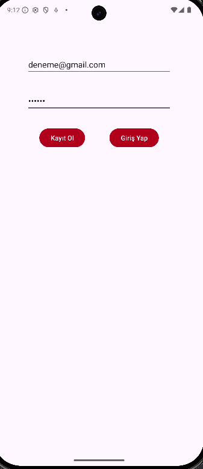
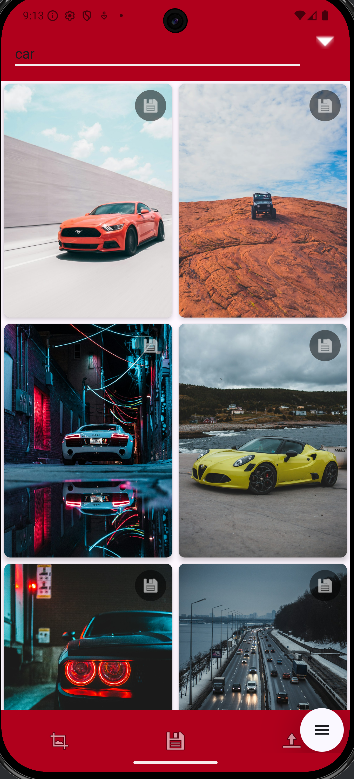
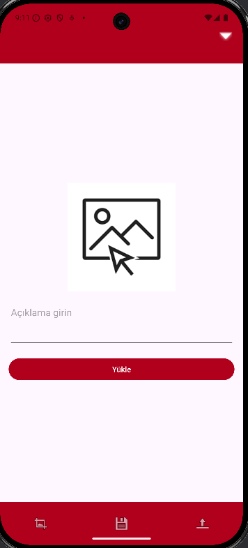
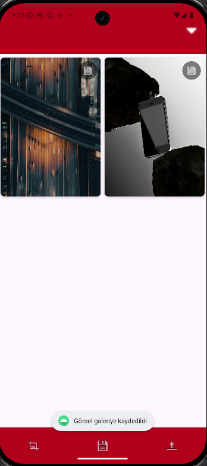
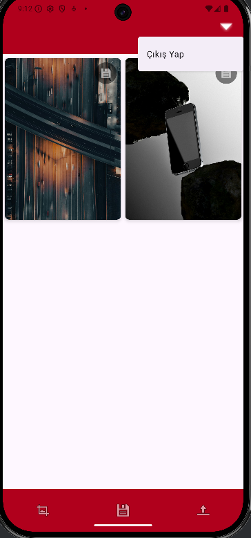

<h1>Pinterest App Klonu</h1>

## Uygulama Görselleri
|             Giriş Ekranı             |                   Ana Sayfa               |                    Filtre                |
| :----------------------------------: | :---------------------------------------: |:---------------------------------------: |
|       |                    |                     |
|             Resim Yükleme            |           Geçmiş İndirmeler               |                  Çıkış Yap               |
|          |                |                   |

<h1>20.04.2025</h1>
Firebase ile hem kullanıcı oluşturma ve girişi yapıldı. Unsplash Api kullanılarak yeni görseller ekrana çekildi.
  

<h1>28.04.2025</h1>
Yeni Değişiklikler: Uygulamaya Arama butonu getirildi. Bu buton Sayesinde hem api hem de Firebase'e eklenen resimleri arayıp bulabiliyoruz. 
Arayüz İyileştirmesi Yapıldı.
  

<h1>29.04.2025</h1>
Proje Bitirildi. 
<h2>Projenin özellikleri;</h2>
<ul>
  <li>Kullanıcı Giriş/Kayıt Ol</li>
  <li>Unsplash Api ile görsel oluşturma</li>
  <li>Gönderileri cihaza indirme</li>
  <li>Uygulamaya gönderi yükleme</li>
  <li>Arama butonu ile görsel filtreleme</li>
  <li>Kullanıcıya özel indirilenler sayfası</li>
  <li>Popup Menu ile Oturum kapatma</li>
</ul>

